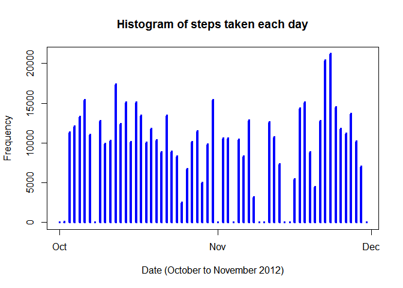
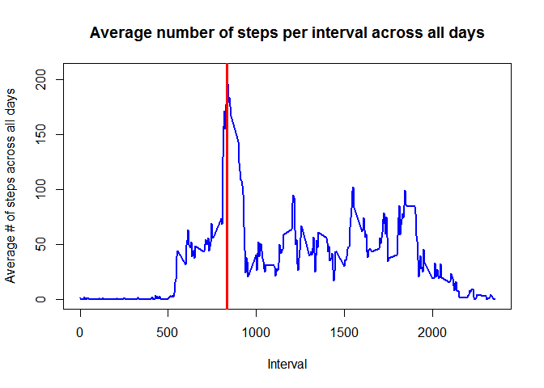
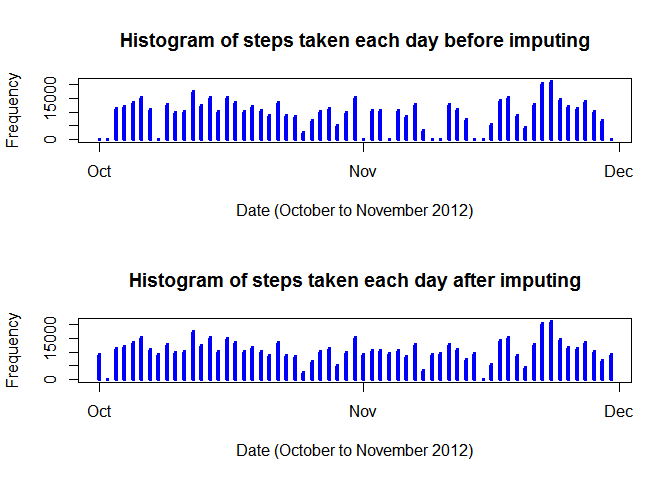
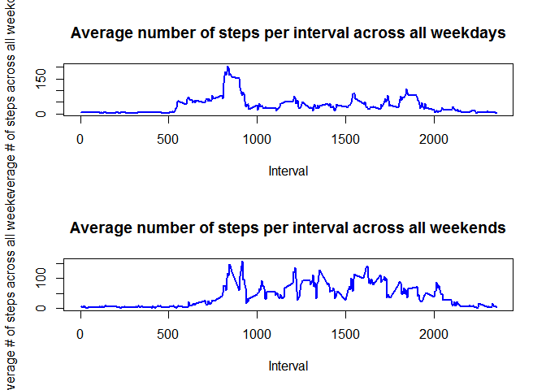

# PA1_Template
Montassar H'Daya : Montassar.hdaya@gmail.com  
March 14, 2015  

**1.Load the data**

```r
# Set The working directory :
setwd("~/R/5.Reproducible Research/repdata-data-activity")
# Read in data file:
dat <- read.csv("activity.csv") 
```

**2.Process/transform the data**


```r
# Turn the date data into a valid date class to allows for easier processing :
# Dates are in YYYY-MM-DD format
dates <- strptime(dat$date, "%Y-%m-%d")
dat$date <- dates

# Keep a list of all possible days
uniqueDates <- unique(dates)

# Keep a list of all possible intervals
uniqueIntervals <- unique(dat$interval)
```

### What is mean total number of steps taken per day?
**1.Calculate the total number of steps taken per day**


```r
# First split up the data frame for steps by day
stepsSplit <- split(dat$steps, dates$yday)

# Next find the total number of steps over each day
totalStepsPerDay <- sapply(stepsSplit, sum, na.rm=TRUE)
totalStepsPerDay 
```

```
##   274   275   276   277   278   279   280   281   282   283   284   285 
##     0   126 11352 12116 13294 15420 11015     0 12811  9900 10304 17382 
##   286   287   288   289   290   291   292   293   294   295   296   297 
## 12426 15098 10139 15084 13452 10056 11829 10395  8821 13460  8918  8355 
##   298   299   300   301   302   303   304   305   306   307   308   309 
##  2492  6778 10119 11458  5018  9819 15414     0 10600 10571     0 10439 
##   310   311   312   313   314   315   316   317   318   319   320   321 
##  8334 12883  3219     0     0 12608 10765  7336     0    41  5441 14339 
##   322   323   324   325   326   327   328   329   330   331   332   333 
## 15110  8841  4472 12787 20427 21194 14478 11834 11162 13646 10183  7047 
##   334 
##     0
```

**2.Create a histogram of the total number of steps taken each day**


```r
# Plot a (pseudo) histogram where the x-axis denotes the day and the y-axis 
#denotes the total number of steps taken for each day :
plot(uniqueDates, totalStepsPerDay, main="Histogram of steps taken each day", 
     xlab="Date (October to November 2012)", ylab="Frequency", type="h", lwd=4, col="blue")
```

 

**3.Calculate and report the mean and median of the total number of steps taken per day**

###The mean steps per day are:

```r
meanStepsPerDay <- sapply(stepsSplit, mean, na.rm=TRUE)
meanDataFrame <- data.frame(date=uniqueDates, meanStepsPerDay=meanStepsPerDay, row.names=NULL)
meanDataFrame
```

```
##          date meanStepsPerDay
## 1  2012-10-01             NaN
## 2  2012-10-02       0.4375000
## 3  2012-10-03      39.4166667
## 4  2012-10-04      42.0694444
## 5  2012-10-05      46.1597222
## 6  2012-10-06      53.5416667
## 7  2012-10-07      38.2465278
## 8  2012-10-08             NaN
## 9  2012-10-09      44.4826389
## 10 2012-10-10      34.3750000
## 11 2012-10-11      35.7777778
## 12 2012-10-12      60.3541667
## 13 2012-10-13      43.1458333
## 14 2012-10-14      52.4236111
## 15 2012-10-15      35.2048611
## 16 2012-10-16      52.3750000
## 17 2012-10-17      46.7083333
## 18 2012-10-18      34.9166667
## 19 2012-10-19      41.0729167
## 20 2012-10-20      36.0937500
## 21 2012-10-21      30.6284722
## 22 2012-10-22      46.7361111
## 23 2012-10-23      30.9652778
## 24 2012-10-24      29.0104167
## 25 2012-10-25       8.6527778
## 26 2012-10-26      23.5347222
## 27 2012-10-27      35.1354167
## 28 2012-10-28      39.7847222
## 29 2012-10-29      17.4236111
## 30 2012-10-30      34.0937500
## 31 2012-10-31      53.5208333
## 32 2012-11-01             NaN
## 33 2012-11-02      36.8055556
## 34 2012-11-03      36.7048611
## 35 2012-11-04             NaN
## 36 2012-11-05      36.2465278
## 37 2012-11-06      28.9375000
## 38 2012-11-07      44.7326389
## 39 2012-11-08      11.1770833
## 40 2012-11-09             NaN
## 41 2012-11-10             NaN
## 42 2012-11-11      43.7777778
## 43 2012-11-12      37.3784722
## 44 2012-11-13      25.4722222
## 45 2012-11-14             NaN
## 46 2012-11-15       0.1423611
## 47 2012-11-16      18.8923611
## 48 2012-11-17      49.7881944
## 49 2012-11-18      52.4652778
## 50 2012-11-19      30.6979167
## 51 2012-11-20      15.5277778
## 52 2012-11-21      44.3993056
## 53 2012-11-22      70.9270833
## 54 2012-11-23      73.5902778
## 55 2012-11-24      50.2708333
## 56 2012-11-25      41.0902778
## 57 2012-11-26      38.7569444
## 58 2012-11-27      47.3819444
## 59 2012-11-28      35.3576389
## 60 2012-11-29      24.4687500
## 61 2012-11-30             NaN
```

###The median steps per day are:

```r
medianStepsPerDay <- sapply(stepsSplit, median, na.rm=TRUE)
medianDataFrame <- data.frame(date=uniqueDates, medianStepsPerDay=medianStepsPerDay, row.names=NULL)
medianDataFrame
```

```
##          date medianStepsPerDay
## 1  2012-10-01                NA
## 2  2012-10-02                 0
## 3  2012-10-03                 0
## 4  2012-10-04                 0
## 5  2012-10-05                 0
## 6  2012-10-06                 0
## 7  2012-10-07                 0
## 8  2012-10-08                NA
## 9  2012-10-09                 0
## 10 2012-10-10                 0
## 11 2012-10-11                 0
## 12 2012-10-12                 0
## 13 2012-10-13                 0
## 14 2012-10-14                 0
## 15 2012-10-15                 0
## 16 2012-10-16                 0
## 17 2012-10-17                 0
## 18 2012-10-18                 0
## 19 2012-10-19                 0
## 20 2012-10-20                 0
## 21 2012-10-21                 0
## 22 2012-10-22                 0
## 23 2012-10-23                 0
## 24 2012-10-24                 0
## 25 2012-10-25                 0
## 26 2012-10-26                 0
## 27 2012-10-27                 0
## 28 2012-10-28                 0
## 29 2012-10-29                 0
## 30 2012-10-30                 0
## 31 2012-10-31                 0
## 32 2012-11-01                NA
## 33 2012-11-02                 0
## 34 2012-11-03                 0
## 35 2012-11-04                NA
## 36 2012-11-05                 0
## 37 2012-11-06                 0
## 38 2012-11-07                 0
## 39 2012-11-08                 0
## 40 2012-11-09                NA
## 41 2012-11-10                NA
## 42 2012-11-11                 0
## 43 2012-11-12                 0
## 44 2012-11-13                 0
## 45 2012-11-14                NA
## 46 2012-11-15                 0
## 47 2012-11-16                 0
## 48 2012-11-17                 0
## 49 2012-11-18                 0
## 50 2012-11-19                 0
## 51 2012-11-20                 0
## 52 2012-11-21                 0
## 53 2012-11-22                 0
## 54 2012-11-23                 0
## 55 2012-11-24                 0
## 56 2012-11-25                 0
## 57 2012-11-26                 0
## 58 2012-11-27                 0
## 59 2012-11-28                 0
## 60 2012-11-29                 0
## 61 2012-11-30                NA
```

##What is the average daily activity pattern?
**1.Make a time series plot (i.e. type = "l") of the 5-minute interval (x-axis) and the average number of steps taken, averaged across all days (y-axis)**


```r
# Time-series plot (type="l")
# x-axis - Time interval (5, 10, 15, ...)
# y-axis - Average number of steps taken across all days for this time interval

# Split up the data according to the interval
intervalSplit <- split(dat$steps, dat$interval)

# Find the average amount of steps per time interval - ignore NA values
averageStepsPerInterval <- sapply(intervalSplit, mean, na.rm=TRUE)

# Plot the time-series graph
plot(uniqueIntervals, averageStepsPerInterval, type="l",
     main="Average number of steps per interval across all days", 
     xlab="Interval", ylab="Average # of steps across all days", 
     lwd=2, col="blue")

# Find the location of where the maximum is
maxIntervalDays <- max(averageStepsPerInterval, na.rm=TRUE)
maxIndex <- as.numeric(which(averageStepsPerInterval == maxIntervalDays))

# Plot a vertical line where the max is
maxInterval <- uniqueIntervals[maxIndex]
abline(v=maxInterval, col="red", lwd=3)
```

 
**2.Which 5-minute interval, on average across all the days in the dataset, contains the maximum number of steps?**

**1.Calculate and report the total number of missing values in the dataset**


```r
maxInterval
```

```
## [1] 835
```

##Imputing missing values


```r
isna<- is.na(dat$steps)
sum(isna)
```

```
## [1] 2304
```
**2.Devise a strategy for filling in all of the missing values in the dataset. 
#The strategy does not need to be sophisticated. For example, you could use 
#the mean/median for that day, or the mean for that 5-minute interval, etc.**


```r
# Modify the meanStepsPerDay vector that contains the mean steps taken
# for this 5 minute interval
# Each day consists of 288 intervals and there are 61 days in total
# First remove NaN values and replace with 0.  
# NaN values are produced when the entire day was filled with NA values
# Essentially the mean and median would be zero anyway!
meanStepsPerDay[is.nan(meanStepsPerDay)] <- 0

# Now create a replicated vector 288 times
# The reason why we're doing this is because the slots
# in the vector naturally line up with the interval for
# a particular day.  Now, all we have to do is find where
# in the data set there are missing steps, and simply do
# a copy from one vector to the other
meanColumn <- rep(meanStepsPerDay, 288)

# The steps before replacement
rawSteps <- dat$steps

# Find any values that are NA in the raw steps data
stepsNA <- is.na(rawSteps)

# Now replace these values with their corresponding mean
rawSteps[stepsNA] <- meanColumn[stepsNA]
```


*3.Create a new dataset that is equal to the original dataset but with the missing data filled in.*


```r
datNew <- dat
datNew$steps <- rawSteps

# First split up the data frame for steps by day
stepsSplitNew <- split(datNew$steps, dates$yday)

# Next find the total number of steps over each day
# There should not be an NA values and so we don't need
# to set the flag
totalStepsPerDayNew <- sapply(stepsSplitNew, sum)
```


**4.Make a histogram of the total number of steps taken each day and Calculate and 
report the mean and median total number of steps taken per day. Do these values
differ from the estimates from the first part of the assignment? What is the impact 
of imputing missing data on the estimates of the total daily number of steps?**


```r
# Plot a (pseudo) histogram where the x-axis denotes the day
# and the y-axis denotes the total number of steps taken 
# for each day
par(mfcol=c(2,1))
# Plot the original histogram first
plot(uniqueDates, totalStepsPerDay, main="Histogram of steps taken each day before imputing", 
     xlab="Date (October to November 2012)", ylab="Frequency", type="h", lwd=4, col="blue")
# Plot the modified histogram after
plot(uniqueDates, totalStepsPerDayNew, main="Histogram of steps taken each day after imputing", 
     xlab="Date (October to November 2012)", ylab="Frequency", type="h", lwd=4, col="blue")
```

 


With this new data, let's calculate the mean over all days (like in Part 2). As a side-by-side comparison, we will place the data before imputing, as well as the new one in the same data frame. Bear in mind that we have replaced all of the NaN values to 0. As such, the mean steps per day of the new data are:


```r
meanStepsPerDayNew <- sapply(stepsSplitNew, mean)
meanDataFrameNew <- data.frame(date=uniqueDates, meanStepsPerDay=meanStepsPerDay, 
meanStepsPerDayNew=meanStepsPerDayNew, row.names=NULL)
meanDataFrameNew
```

```
##          date meanStepsPerDay meanStepsPerDayNew
## 1  2012-10-01       0.0000000         32.3355276
## 2  2012-10-02       0.4375000          0.4375000
## 3  2012-10-03      39.4166667         39.4166667
## 4  2012-10-04      42.0694444         42.0694444
## 5  2012-10-05      46.1597222         46.1597222
## 6  2012-10-06      53.5416667         53.5416667
## 7  2012-10-07      38.2465278         38.2465278
## 8  2012-10-08       0.0000000         32.2632378
## 9  2012-10-09      44.4826389         44.4826389
## 10 2012-10-10      34.3750000         34.3750000
## 11 2012-10-11      35.7777778         35.7777778
## 12 2012-10-12      60.3541667         60.3541667
## 13 2012-10-13      43.1458333         43.1458333
## 14 2012-10-14      52.4236111         52.4236111
## 15 2012-10-15      35.2048611         35.2048611
## 16 2012-10-16      52.3750000         52.3750000
## 17 2012-10-17      46.7083333         46.7083333
## 18 2012-10-18      34.9166667         34.9166667
## 19 2012-10-19      41.0729167         41.0729167
## 20 2012-10-20      36.0937500         36.0937500
## 21 2012-10-21      30.6284722         30.6284722
## 22 2012-10-22      46.7361111         46.7361111
## 23 2012-10-23      30.9652778         30.9652778
## 24 2012-10-24      29.0104167         29.0104167
## 25 2012-10-25       8.6527778          8.6527778
## 26 2012-10-26      23.5347222         23.5347222
## 27 2012-10-27      35.1354167         35.1354167
## 28 2012-10-28      39.7847222         39.7847222
## 29 2012-10-29      17.4236111         17.4236111
## 30 2012-10-30      34.0937500         34.0937500
## 31 2012-10-31      53.5208333         53.5208333
## 32 2012-11-01       0.0000000         32.0149498
## 33 2012-11-02      36.8055556         36.8055556
## 34 2012-11-03      36.7048611         36.7048611
## 35 2012-11-04       0.0000000         32.4504726
## 36 2012-11-05      36.2465278         36.2465278
## 37 2012-11-06      28.9375000         28.9375000
## 38 2012-11-07      44.7326389         44.7326389
## 39 2012-11-08      11.1770833         11.1770833
## 40 2012-11-09       0.0000000         32.3078945
## 41 2012-11-10       0.0000000         32.8706718
## 42 2012-11-11      43.7777778         43.7777778
## 43 2012-11-12      37.3784722         37.3784722
## 44 2012-11-13      25.4722222         25.4722222
## 45 2012-11-14       0.0000000         32.9865210
## 46 2012-11-15       0.1423611          0.1423611
## 47 2012-11-16      18.8923611         18.8923611
## 48 2012-11-17      49.7881944         49.7881944
## 49 2012-11-18      52.4652778         52.4652778
## 50 2012-11-19      30.6979167         30.6979167
## 51 2012-11-20      15.5277778         15.5277778
## 52 2012-11-21      44.3993056         44.3993056
## 53 2012-11-22      70.9270833         70.9270833
## 54 2012-11-23      73.5902778         73.5902778
## 55 2012-11-24      50.2708333         50.2708333
## 56 2012-11-25      41.0902778         41.0902778
## 57 2012-11-26      38.7569444         38.7569444
## 58 2012-11-27      47.3819444         47.3819444
## 59 2012-11-28      35.3576389         35.3576389
## 60 2012-11-29      24.4687500         24.4687500
## 61 2012-11-30       0.0000000         32.2280213
```


**Like the above, the median steps per day are:**


```r
medianStepsPerDayNew <- sapply(stepsSplitNew, median)
medianDataFrameNew <- data.frame(date=uniqueDates, medianStepsPerDay=medianStepsPerDay, 
medianStepsPerDayNew=medianStepsPerDayNew, row.names=NULL)
```

**the only values that have changed are those days where all of the observations were missing (i.e. those days having all zeroes / NA). The rest of the observations have stayed the same** 

##Are there differences in activity patterns between weekdays and weekends?

With the new data set we have just created, we are going to split up the data into two data frames - one data frame consists of all steps taken on a weekday, while the other data frame consists of all steps taken on a weekend. The following R code illustrates this for us:

**1.Create a new factor variable in the dataset with two levels :weekdayây and weekendây indicating whether a given date is a weekday or weekend day.**

```r
# Part 5 - Now split up the data so that it's sorted by weekday or weekend
# We have casted the dates to a POSIXlt class so wday is part of this class
# wday is an integer ranging from 0 to 6 that represents the day of the week
# 0 is for Sunday, 1 is for Monday, going up to 6 for Saturday
# Store this into wdays
wdays <- dates$wday

# Create a new factor variable that classifies the day as either a weekday or weekend
# First, create a numeric vector with 2 levels - 1 is for a weekday, 2 for a weekend
classifywday <- rep(0, length(wdays)-1) # 17568 observations overall

# Any days that are from Monday to Friday, set the numeric vector in these positions
# as 1
classifywday[wdays >= 1 & wdays <= 5] <- 1

# Any days that are on Saturday or Sunday, set the numeric vector in these positions
# as 2
classifywday[wdays == 6 | wdays == 0] <- 2

# Create a new factor variable that has labels Weekdays and Weekends
daysFactor <- factor(classifywday, levels=c(1,2), labels=c("Weekdays", "Weekends"))

# Create a new column that contains this factor for each day
datNew$typeOfDay <- daysFactor

# Now split up into two data frames
datWeekdays <- datNew[datNew$typeOfDay == "Weekdays", ]
datWeekends <- datNew[datNew$typeOfDay == "Weekends", ]
```
**2.Make a panel plot containing a time series plot (i.e. type = "l") of the 5-minute interval (x-axis) and the average number of steps taken, averaged across all weekday days or weekend days (y-axis). See the README file in the GitHub repository to see an example of what this plot should look like using simulated data**

Now that we have accomplished this, let's split up the data for each data frame so that we will have two sets of individual data frames. One set is for weekdays and within this data frame are individual data frames. Each data frame contains the steps for each interval recorded on a weekday. The other set is for weekends, and within this data frame are individual data frames. Like previously, each data frame here contains the steps for each interval recorded on a weekday. Once we have these two sets of data frames, we will now calculate the mean amount of steps for each interval for the weekdays data frame and weekends data frame. This will result in two vectors - one for the weekdays and the other for weekends. The following R code does this for us:


```r
# Further split up the Weekdays and Weekends into their own intervals
datSplitWeekdays <- split(datWeekdays$steps, datWeekdays$interval)
datSplitWeekends <- split(datWeekends$steps, datWeekends$interval)

# Find the average for each interval
meanStepsPerWeekdayInterval <- sapply(datSplitWeekdays, mean)
meanStepsPerWeekendInterval <- sapply(datSplitWeekends, mean)

par(mfcol=c(2,1))
plot(uniqueIntervals, meanStepsPerWeekdayInterval, type="l",
main="Average number of steps per interval across all weekdays", 
xlab="Interval", ylab="Average # of steps across all weekdays", 
lwd=2, col="blue")
plot(uniqueIntervals, meanStepsPerWeekendInterval, type="l",
main="Average number of steps per interval across all weekends", 
xlab="Interval", ylab="Average # of steps across all weekends", 
lwd=2, col="blue")
```

 


